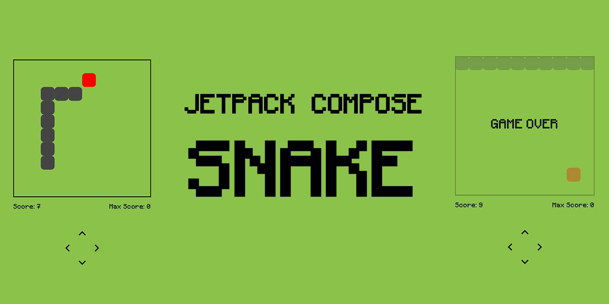
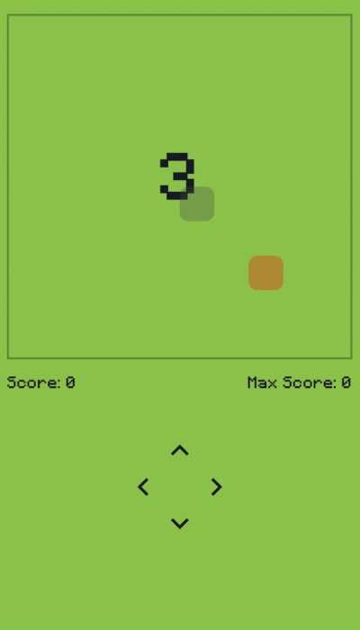

🐍 Snake Game on Jetpack Compose

A simple and flexible implementation of the classic Snake game using Jetpack Compose and the MVI architecture. All logic is placed in a separate Game Engine, and the state is controlled via StateFlow, which makes the code clean, scalable and easily extensible.

🚀 Features
✅ Pure MVI architecture – clear separation of state, intents, and processing.
✅ Flexible game engine – GameEngine is responsible for all game logic.Proper state management – GameState is immutable and updated via ViewModel.
✅ Smart speed management – speeding up the game when collecting food. Processed collisions – the snake cannot turn in the opposite direction. 
✅ The minimum dependencies are only Jetpack Compose and StateFlow.

🏗 Architecture (MVI)

Model (Game State)

GameState is an immutable model of the game state.

GameStatus is an enum class with game statuses (Pause, Running, GameOver).

View (UI on Jetpack Compose)

SnakeGame() is the main screen with a game board and controllers.

GameCanvas() – rendering snakes and food through Canvas.

ControlPanel() – buttons for controlling the direction of the snake.

InfoPanel() – displays the current score and the maximum record.

Intent (User Events)

SnakeIntent – user intents (Pause, Run, Restart, Rotate).

SnakeViewModel – processing intents and updating GameState via StateFlow.

Game Engine (Game Engine)

DefaultGameEngine – controls snake movement, food generation, and collision logic.

nextPoint() – calculates the next position of the snake's head.

generateNewFood() – selects a new food position based on occupied cells.

📜 License

This project is distributed under the MIT license. Use, improve, adapt! 🎉
